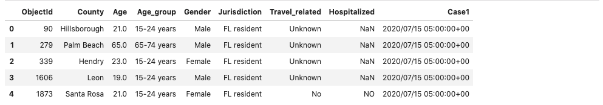

# Covid 19 Project

**Team Members:** Chika Ozodiegwu, Kelsey Wyatt, Libardo Lambrano, Kurt Pessa

[Google Doc with Project Info](https://docs.google.com/document/d/1eqhODgskdKG3WJYACiSXgGqDT9dvwouSgv8UbxjRPY0/edit?usp=sharing)

___

### Data set used:
**Florida COVID19 Case Line Data** from the Florida Department of Health Open Data. [Available Here](https://open-fdoh.hub.arcgis.com/datasets/florida-covid19-case-line-data)


___

### Research Question
> **“Has hospitalizations (#) in Florida changed since reopening?”**

### Process of Data Analysis

#### Step 1: Raw Data Collection


<details><summary>Expand to view code</summary>
    
```
    import pandas as pd
    df = pd.read_csv("Resources/Florida_COVID19_Case_Line_Data.csv")
    df.head(3)
```
</details>

___

#### Step 2: Data Processiong & Data Cleaning

**Single group**


<details><summary>Expand to view code</summary>
    
```
    #df = step2.get_hospitalized_data()
    #df = step2.get_df_with_datetime_and_formatted_column()
    #df = step2.get_hospitalizations_by_casedatetime()

    group_name = "Gender"
    #group_name = "Age_group"
    #group_name = "Travel_related"
    #group_name = "Jurisdiction"
    #group_name = "County"

    df = step2.get_group(group_name)

    df
```
</details>
<br/>

**Two groups: before and after opening**


<details><summary>Expand to view code</summary>
    
```
    #df1, df2 = step2.get_groups_before_and_after_opening_date()
    #df1, df2 = step2.get_groups_by_casedatetime()

    group_name = "Gender"
    #group_name = "Age_group"
    #group_name = "Travel_related"
    #group_name = "Jurisdiction"
    #group_name = "County"

    df1,df2 = step2.get_groups(group_name)

    #df
    pd.concat([df1,df2],axis=1)
```
</details>
<br/>

**CSV clean up**



<details><summary>Expand to view code</summary>
    
```
    total_cases_county = new_csv_data_df.groupby(by="County").count().reset_index().loc[:,["County","Case1"]]
    total_cases_county.rename(columns={"County": "County", "Case1": "Total Cases"})
```
</details>
<br/>

___

### Part 1: Six (6) Steps for Hypothesis Testing 

#### 1. Identify
- **Populations** (divide Hospitalization data in two groups of data):
    1. Prior to opening
    2. After opening  
* Decide on the **date**:
    * May 4th - restaurants opening to 25% capacity
    * June  (Miami opening beaches)
- Distribution:
    * Distribution

#### 2. State the hypotheses
- **H0**: There is no change in hospitalizations after Florida has reopened
- **H1**: There is a change in hospitalizations after Florida has reopened

#### 3. Characteristics of the comparison distribution
- Population means, standard deviations

#### 4. Critical values
- p = 0.05
- Our hypothesis is nondirectional so our hypothesis test is **two-tailed**

#### 5. Calculate

#### 6. Decide!

___

### Part 2: Visualization

#### 1. Number of cases


<details><summary>Expand to view code</summary>
    
```
    Total_covid_cases = new_csv_data_df["ObjectId"].nunique()
    Total_covid_cases = pd.DataFrame({"Total Number of Cases": [Total_covid_cases]})
    Total_covid_cases
```
</details>
<br/>

#### 2. Total number of cases per county


<details><summary>Expand to view code</summary>

```
    #Total number of cases per county
    total_cases_county = new_csv_data_df.groupby(by="County").count().reset_index().loc[:,["County","Case1"]]
    total_cases_county.rename(columns={"County": "County", "Case1": "Total Cases"})

    #Total number of cases per county sorted
    total_cases_county = total_cases_county.sort_values('Case1',ascending=False)
    total_cases_county.head(20)

    #Bar chart for total cases per county
    total_cases_county.plot(kind='bar',x='County',y='Case1', title ="Total Cases per County", figsize=(15, 10), color="blue")

    plt.title("Total Cases per County")
    plt.xlabel("County")
    plt.ylabel("Number of Cases")
    plt.legend(["Number of Cases"])
    plt.show()
```
    
</details>
<br/>


