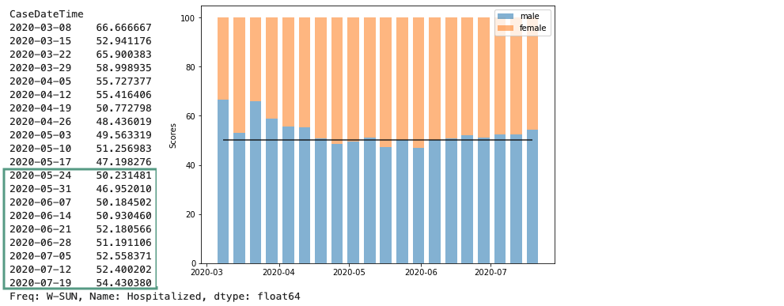

# COVID 19 Project

**Team Members:** Chika Ozodiegwu, Kelsey Wyatt, Libardo Lambrano, Kurt Pessa

[Google Doc with Project Info](https://docs.google.com/document/d/1eqhODgskdKG3WJYACiSXgGqDT9dvwouSgv8UbxjRPY0/edit?usp=sharing)

___

**CHIKA**

<details><summary>Expand to view</summary>

### Motivation

- **Core message** 
   - Coronavirus disease 2019 (COVID-19) is an infectious disease caused by severe acute respiratory syndrome coronavirus 2 (SARS-CoV-2). 
   - First identified in December 2019 in Wuhan, Hubei, China, and has resulted in an ongoing pandemic.
   - First confirmed case has been traced back to 17 November 2019 in Hubei
   - As of 23 July 2020, more than 15.2 million cases have been reported across 188 countries and territories, resulting in more than 623,000 deaths. 
   - Florida is currently considered an epi-center for the virus with 380,000 and at least 5,000 deaths.
   - With cases surging, hospitals across the country are reporting an uptick in hospitalization rate and ICU admissions. 
   
- **Research Questions**
> **“Has hospitalizations (#) in Florida changed since reopening?”**
> **"If yes, how much did it change?"**
> **"How does hospitalization vary by age, county, gender and similar factors?"**


### Data set used:
**Florida COVID19 Case Line Data** from the Florida Department of Health Open Data. [Available Here](https://open-fdoh.hub.arcgis.com/datasets/florida-covid19-case-line-data)


### Process of Data Analysis

#### Step 1: Raw Data Collection


<details><summary>Expand to view code</summary>

```python
    import pandas as pd
    df = pd.read_csv("Resources/Florida_COVID19_Case_Line_new_Data.csv")
    df.head(3)
```
</details>

</details>
___

    
**KURT**

<details><summary>Expand to view</summary>

# COVID-19
---------
<table align="left">
    <tr align="left">
        <th width="15%">
            
        </th>
        <th align="left"> 
            <p align="left" style="font-size:18px"> Decided to look at hospitalizations!</p>
            <ol align="left" style="font-style:normal;font-family:arial;font-size:14px;">
                <li align="left" style="margin:15px 0"> Testing agnostic</li>
                <li align="left" style="margin:15px 0"> Can indicate:
                    <ol style="margin:10px 0">
                        <li style="margin:10px 0"> Case burden</li>
                        <li style="margin:10px 0"> Financial impact</li>
                        <li style="margin:10px 0"> Severity of cases</li>
                    </ol>
                </li>
            </ol>
        </th>
    </tr>
</table>

<details><summary>Expand to view code</summary>

```python
# Plotting summary of hospitalizations in Florida
df = step2.get_hospitalizations_by_casedatetime()
plt.figure(figsize=(10,4))
plt.scatter(df['CaseDateTime'],df['Hospitalized'])
plt.title("Hospitalization in Florida")
plt.ylabel("Hospitalized")
plt.xlim((dt.date(2020,3,1),dt.date(2020,8,1)))

# Using mdates.ConciseDateFormatter for xlabels
locator = mdates.AutoDateLocator(minticks=3, maxticks=7)
formatter = mdates.ConciseDateFormatter(locator)
ax = plt.gca()
ax.xaxis.set_major_formatter(formatter)
plt.xlabel("Date")
plt.savefig("Images/hospitalization_in_florida_summary.png")
```

</details>
<br/>


<details><summary>Data Processing & Data Cleaning</summary>
    
#### Step 2: Data Processing & Data Cleaning

**CSV clean up**


<details><summary>Expand to view code</summary>

```python

new_csv_data_df = df[['ObjectId', "County",'Age',"Age_group", "Gender", "Jurisdiction","Travel_related", "Hospitalized","Case1"]]

new_csv_data_df['Date'] = pd.to_datetime(new_csv_data_df['Case1']).dt.date
new_csv_data_df['Time'] = pd.to_datetime(new_csv_data_df['Case1']).dt.time

new_csv_data_df1 = new_csv_data_df[['ObjectId', "County",'Age',"Age_group", "Gender", "Jurisdiction", "Travel_related", "Hospitalized","Date"]]
new_csv_data_df1
    
```

</details>
<br/>

**Single group**


<details><summary>Expand to view code</summary>

```python
    #df = step2.get_hospitalized_data()
    #df = step2.get_df_with_datetime_and_formatted_column()
    #df = step2.get_hospitalizations_by_casedatetime()

    group_name = "Gender"
    #group_name = "Age_group"
    #group_name = "Travel_related"
    #group_name = "Jurisdiction"
    #group_name = "County"

    df = step2.get_group(group_name)

    df
```
</details>
<br/>

**Two groups: before and after opening**


<details><summary>Expand to view code</summary>

```python
    df1, df2 = step2.get_groups_before_and_after_opening_date()
    df1, df2 = step2.get_groups_by_casedatetime()


    group_name = "Gender"
    group_name = "Age_group"
    group_name = "Travel_related"
    group_name = "Jurisdiction"
    group_name = "County"

    df1,df2 = step2.get_groups(group_name)

    #df
    pd.concat([df1,df2],axis=1)
```
</details>
<br/>

</details>
<br/>

#### Research Question to Answer:
* “Has hospitalizations (#) in Florida changed since reopening?"

#### 1. Identify
- **Populations** (divide Hospitalization data into two groups of data):
    1. Prior to opening
    2. After opening  
* Decide on the **date**:
    * May 4th - restaurants opening to 25% capacity
* Pick sample size:
    * Decided on **30 days** before and after

<details><summary>Expand to view code</summary>

```python
# Plot data set 30 days prior and after reopening
df = step2.get_hospitalizations_by_casedatetime()
filt1 = (df['CaseDateTime'] >= (dt.datetime(2020,5,4)-dt.timedelta(days=30)))
filt2 = (df['CaseDateTime'] <= (dt.datetime(2020,5,4)+dt.timedelta(days=30)))
filt = (filt1 & filt2)
df = df[filt]
plt.figure(figsize=(10,6))
plt.scatter(df['CaseDateTime'],df["Hospitalized"])
plt.xlim((dt.datetime(2020,5,4)-dt.timedelta(days=32)),(dt.datetime(2020,5,4)+dt.timedelta(days=32)))
plt.vlines(dt.datetime(2020,5,4), 0, 270, linestyles ="dotted", colors ="k") 
plt.annotate("Florida reopens", (dt.datetime(2020,5,5),250))
plt.title("Hospitalizations in Florida before and after reopening")
plt.ylabel("New Hospitalizations")
plt.xlabel("Date")
locator = mdates.AutoDateLocator(minticks=3, maxticks=7)
formatter = mdates.ConciseDateFormatter(locator)
ax = plt.gca()
ax.xaxis.set_major_formatter(formatter)
plt.savefig("Images/hospitalizations_before_and_after_reopening_0.png")
plt.show()
```

</details>
<br/>


#### 2. State the hypotheses
- **H0**: There is no change in hospitalizations after Florida has reopened
- **H1**: There is an increase in hospitalizations after Florida has reopened


#### 3. Characteristics of the comparison distribution

- Population means, standard deviations


<details><summary>Expand to view code</summary>

```python
sample1 = df1['Hospitalized']
sample2 = df2['Hospitalized']
pd.DataFrame({
    "Before Opening:": sample1.describe(),
    "After Opening": sample2.describe()
}).style.format("{:.1f}")
```

</details>
<br/>


#### 4. Distribution 

<details><summary>Expand to view code</summary>

```python
# Scatter Plot of Data
plt.figure(figsize=(10,6))
plt.subplot(2, 1, 1)
plt.scatter(range(len(sample1)), sample1, label="before")
plt.scatter(range(len(sample2)), sample2, label="after")
plt.legend()

# Histogram Plot of Data
plt.subplot(2, 1, 2)
plt.hist(sample1, 20, density=True, alpha=0.7, label="before")
plt.hist(sample2, 20, density=True, alpha=0.7, label="after")
plt.axvline(sample1.mean(), color='k', linestyle='dashed', linewidth=1)
plt.axvline(sample2.mean(), color='k', linestyle='dashed', linewidth=1)
plt.legend()  
plt.savefig("Images/before_and_after_histogram.png")
plt.show()
```

</details>
<br/>


#### 5. Critical values
- p = 0.05
- Our hypothesis is nondirectional so our hypothesis test is **two-tailed**
- **Test used** = T-Test

<details><summary>Expand to view code</summary>

```python

statistic, pvalue = stats.ttest_ind_from_stats(grouped_before["Hospitalized"].mean(),grouped_before["Hospitalized"].std(),grouped_before["Hospitalized"].size,grouped_after["Hospitalized"].mean(),grouped_after["Hospitalized"].std(),grouped_after["Hospitalized"].size)
print(f"p-value: {pvalue:.4f}")
    
```
</details>
<br/>

    **p-value** = 0.00000026

#### 6. Decide

* We are able to ***reject*** the null hypothesis that there was no change. With the data set we analyzed, there was a significant change from before to after reopening in Florida.

</details>
___

**KELSEY**
    
<details><summary>Expand to view</summary>

### Part 2: Analysis and Visualizations


#### 1. Total number of cases


<details><summary>Expand to view code</summary>

```python
Total_covid_cases = new_csv_data_df["ObjectId"].nunique()
Total_covid_cases = pd.DataFrame({"Total Number of Cases": [Total_covid_cases]})
Total_covid_cases
```

</details>
<br/>

____

#### 2. Total number of cases per county


<details><summary>Expand to view code</summary>

```python
#Total number of cases per county
total_cases_county = new_csv_data_df.groupby(by="County").count().reset_index().loc[:,["County","Case1"]]
total_cases_county.rename(columns={"County": "County", "Case1": "Total Cases"})

#Total number of cases per county sorted
total_cases_county = total_cases_county.sort_values('Case1',ascending=False)
total_cases_county.head(20)

#Bar chart for total cases per county
total_cases_county.plot(kind='bar',x='County',y='Case1', title ="Total Cases per County", figsize=(15, 10), color="blue")

plt.title("Total Cases per County")
plt.xlabel("County")
plt.ylabel("Number of Cases")
plt.legend(["Number of Cases"])
plt.show()
```

</details>
<br/>

___

#### 3. Top 10 counties with total cases


<details><summary>Expand to view code</summary>

```python
#Top 10 counties with total cases
top10_county_cases = total_cases_county.sort_values(by="Case1",ascending=False).head(10)
top10_county_cases["Rank"] = np.arange(1,11)
top10_county_cases.set_index("Rank").style.format({"Case1":"{:,}"})

#Bar chart for total cases for top 10 counties
top10_county_cases.plot(kind='bar',x='County',y='Case1', title ="Total Cases for Top 10 Counties", figsize=(15, 10), color="blue")

plt.title("Total Hospitalizations for Top 10 Counties")
plt.xlabel("County")
plt.ylabel("Number of Cases")
plt.legend(["Number of Cases"])
plt.show()
```

</details>
<br/>

____

#### 4. Top 10 counties trending view of total cases as a percentage of total (top 10)


<details><summary>Expand to view code</summary>

```
code here
```

</details>
<br/>

____

#### 5. Total number of cases by gender 


<details><summary>Expand to view code</summary>

```
    # Total number of cases by gender
    total_cases_gender = new_csv_data_df.groupby(by="Gender").count().reset_index().loc[:,["Gender","Case1"]]
    total_cases_gender.rename(columns={"Gender": "Gender", "Case1": "Total Cases"})

    # Pie chart for total number of cases by gender
    total_cases_gender = new_csv_data_df["Gender"].value_counts()

    colors=["pink", "blue", "green"]

    explode=[0.1,0.1,0.1]

    total_cases_gender.plot.pie(explode=explode,colors=colors, autopct="%1.1f%%", shadow=True, subplots=True, startangle=120);

    plt.title("Total Number of Cases in Males vs. Females")
```

</details>
<br/>
____
    
#### 6. Total Number of Hospitalizations


<details><summary>Expand to view code</summary>

```
    #Filter data to show only cases that include hospitalization
    filt = new_csv_data_df["Hospitalized"] == "YES"
    df = new_csv_data_df[filt]
    df
```

</details>
<br/>

#### 7. Total Number of Hospitalizations by County 
    
    
    
</details>
</details>
___

**LIBARDO**

<details><summary>Expand to view</summary>
    
#### 8. Percentage of hospitalizations by gender



<details><summary>Expand to view code</summary>

```
    # Calculate percentages male/female
    df = step2.get_df_with_datetime_and_formatted_column()
    filt = df['Gender']=='Male'
    df = df[filt]
    df = step2.get_hospitalizations_by_casedatetime(df)
    male_by_week = df.groupby(pd.Grouper(freq='W',key='CaseDateTime')).sum()

    df = step2.get_df_with_datetime_and_formatted_column()
    filt = df['Gender']=='Female'
    df = df[filt]
    df = step2.get_hospitalizations_by_casedatetime(df)
    female_by_week = df.groupby(pd.Grouper(freq='W',key='CaseDateTime')).sum()

    male_perc = male_by_week['Hospitalized']/(male_by_week['Hospitalized']+female_by_week['Hospitalized'])*100
    female_perc = female_by_week['Hospitalized']/(male_by_week['Hospitalized']+female_by_week['Hospitalized'])*100

    # Plot data 
    import matplotlib.pyplot as plt
    plt.figure(figsize=(8,6))
    p1 = plt.bar(male_perc.index,male_perc,width=5,label='male',alpha=0.5)
    p2 = plt.bar(female_perc.index,female_perc,bottom=male_perc,width=5,label='female',alpha=0.5)
    plt.hlines(y=50,xmin=male_perc.index[0],xmax=male_perc.index[-1],alpha=0.8)
    plt.ylabel('Scores')
    plt.legend(handles=[p1,p2])
    plt.show()
```

</details>
<br/>

____

#### 9. Total and Percentage of hospitalizations by age group


<details><summary>Expand to view code</summary>

```python 
    Total_hospitalized = hosp_filter_df["Hospitalized"].count()
    
    demo_age_grouped = hosp_filter_df.groupby("Age_group")
    total_hospitalize_count = demo_age_grouped["Hospitalized"].value_counts()

    age_percentage = (total_hospitalize_count/Total_hospitalized) * 100    
    Age_demographic_summary["Total Count"].plot(kind= "bar", color = "g", figsize=(20, 10))

    plt.title("Hospitalized Patients by age")
    plt.xlabel("Age Group, Hospitalized")
    plt.ylabel("Number of Hospitalization")

    plt.show()
```

</details>
<br/>

____

#### 10. Hospitalizations by date


<details><summary>Expand to view code</summary>

```
    import seaborn as sns
    new_csv_data_df['Count']=np.where(new_csv_data_df['Hospitalized']=='YES', 1,0)
    new_csv_data_df.head()
    new_csv_data_df['Count2']=1
    new_csv_data_df['Case1']=pd.to_datetime(new_csv_data_df['Case1'])
    case_plot_df=pd.DataFrame(new_csv_data_df.groupby(['Hospitalized', pd.Grouper(key='Case1', freq='W')])['Count2'].count())
    case_plot_df.reset_index(inplace=True)
    plt.subplots(figsize=[15,7])
    sns.lineplot(x='Case1', y='Count2', data=case_plot_df, hue='Hospitalized')
    plt.xticks(rotation=45)
```

</details>
<br/>

____

#### 11. Compare travel-related hospitalization and travel-related cases


<details><summary>Expand to view code</summary>

```python
    travel_vs_nontravel = new_csv_data_df1["Travel_related"].value_counts()
  

    colors = ['green', 'red', 'orange']
    explode = (0.1, 0, 0)
    travel_vs_nontravel.plot(kind="pie", colors= colors, explode= explode, startangle=140, shadow = True, autopct='%1.1f%%')
    plt.title("Travel Related Cases")
    plt.show()

```

</details>
<br/>

____

#### 12. Hospitalization by county before reopening 


<details><summary>Expand to view code</summary>

```python
    my_colors = ['r', 'g', 'b', 'k', 'y', 'm', 'c']  # red, green, blue, black, etc.
    my_colormap = ListedColormap(my_colors)

    Before_hosp_county = hosp_filter_df_new["County"].value_counts().plot(kind= "barh", colormap = my_colormap, figsize=(20, 15))

    #chart title
    plt.title("Total Hospitalization for each county before reopening")
    plt.xlabel("County")
    plt.ylabel("Number of Hospitalization")

    plt.show()
```

</details>
<br/>

____

#### 13. Hospitalization by county after reopening


<details><summary>Expand to view code</summary>

```
    After_hosp_county = hosp_filter_df_new1["County"].value_counts().plot(kind= "barh", figsize=(20, 15))

#chart title
plt.title("Total Hospitalization for each county after reopening")
plt.xlabel("County")
plt.ylabel("Number of Hospitalization")

plt.show()
```

</details>
<br/>

____

#### 14. Statistical summaries 


</details>
<br/>
____
    
**CHIKA**

<details><summary>Expand to view</summary>
    
### Part 3: Discussion & Conclusions 
- **Discussion**: It was clear from our analysis that the top three states that had the highest hospitalization rates after Florida reopened were Dade County, Broward County and Palm Beach County. Additional, men were equally as likely to be hospitalized as women were. Most cases and hospitalizated case were not travel-related which may offer an insight that the cases were most likely as a result of community spread. The average age of all hospitalized patients was approximately 63 years and the median age was 65 years. We also looked at this statistics after separating the data to before and after reopening. The average age and median age for both groups were in the 60s. Although hospitalization rates seemed like it rose after reopening, there was a sharp decline in July as eveidenced from the graph. However, this decline is question due to the limitations of the data

- **Limitations**: Florida data provided had many unknown variables so it was difficult to put together a strong case. Although information for cases was provided, information on hoispitalization that may have resulted from the cases was not unknown in many cases. We can argue that the cases increased after reopning before it saw a sharp decline, we need more information to ensure our research is valid and realiable. 
    
</details>
<br/>    

### Questions?


