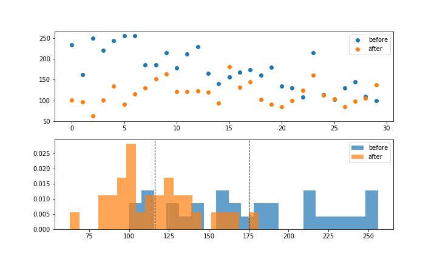

# COVID 19 Project

**Team Members:** Chika Ozodiegwu, Kelsey Wyatt, Libardo Lambrano, Kurt Pessa

[Google Doc with Project Info](https://docs.google.com/document/d/1eqhODgskdKG3WJYACiSXgGqDT9dvwouSgv8UbxjRPY0/edit?usp=sharing)

___

### Data set used:
**Florida COVID19 Case Line Data** from the Florida Department of Health Open Data. [Available Here](https://open-fdoh.hub.arcgis.com/datasets/florida-covid19-case-line-data)


___
### Motivation & Summary Slide

**Research Question**
> **“Has hospitalizations (#) in Florida changed since reopening?”**
**Add why we decided to ask the question

### Process of Data Analysis

#### Step 1: Raw Data Collection


<details><summary>Expand to view code</summary>

```
    import pandas as pd
    df = pd.read_csv("Resources/Florida_COVID19_Case_Line_new_Data.csv")
    df.head(3)
```
</details>

___

#### Step 2: Data Processing & Data Cleaning

**CSV clean up**


<details><summary>Expand to view code</summary>

``` 
    new_csv_data_df = df[['ObjectId', "County",'Age',"Age_group", "Gender", "Jurisdiction","Travel_related", "Hospitalized","Case1"]]

    new_csv_data_df['Date'] = pd.to_datetime(new_csv_data_df['Case1']).dt.date
    new_csv_data_df['Time'] = pd.to_datetime(new_csv_data_df['Case1']).dt.time

    new_csv_data_df1 = new_csv_data_df[['ObjectId', "County",'Age',"Age_group", "Gender", "Jurisdiction", "Travel_related", "Hospitalized","Date"]]
    new_csv_data_df1
    
```
</details>
<br/>


**Single group**


<details><summary>Expand to view code</summary>

```
    #df = step2.get_hospitalized_data()
    #df = step2.get_df_with_datetime_and_formatted_column()
    #df = step2.get_hospitalizations_by_casedatetime()

    group_name = "Gender"
    #group_name = "Age_group"
    #group_name = "Travel_related"
    #group_name = "Jurisdiction"
    #group_name = "County"

    df = step2.get_group(group_name)

    df
```
</details>
<br/>

**Two groups: before and after opening**


<details><summary>Expand to view code</summary>
<<<<<<< HEAD

```python
df1, df2 = step2.get_groups_before_and_after_opening_date()
df1, df2 = step2.get_groups_by_casedatetime()


group_name = "Gender"
group_name = "Age_group"
group_name = "Travel_related"
group_name = "Jurisdiction"
group_name = "County"

df1,df2 = step2.get_groups(group_name)

#df
pd.concat([df1,df2],axis=1)
```
</details>
<br/>

**CSV clean up**


<details><summary>Expand to view code</summary>
```
    
</details>
<br/>

___
<<<<<<< HEAD

### Part 1: Six (6) Steps for Hypothesis Testing 

#### 1. Identify

- **Populations** (divide Hospitalization data in two groups of data):
    1. Prior to opening
    2. After opening  
* Decide on the **date**:

### Data Analysis and Visualization
**Part 1: Six (6) Steps for Hypothesis Testing** 

**1. Identify**
- **Population**: Florida residents and Transients
(divide Hospitalization data in two groups):
    1. **Date set 1**: Prior to opening (< 05-04-2020)
    2. **Date set 2**: After opening  (> 05-04-2020)
* **Information on dates**:

    * May 4th - restaurants opening to 25% capacity
    * June  (Miami opening beaches)

#### 2. State the hypotheses
- **H0**: There is no change in hospitalizations after Florida has reopened
- **H1**: There is an increase in hospitalizations after Florida has reopened


#### 3. Characteristics of the comparison distribution


- Population means, standard deviations

#### 3. Interesting figures developed during exploration
- Considered 14 days COVID-19 incubation period


<details><summary>Expand to view code</summary>

​```python
    sample1 = df1['Hospitalized']
    sample2 = df2['Hospitalized']
    pd.DataFrame({
        "Before Opening:": sample1.describe(),
        "After Opening": sample2.describe()
    }).style.format("{:.1f}")
    
```
</details>
<br/>

```python
sample1 = df1['Hospitalized']
sample2 = df2['Hospitalized']
pd.DataFrame({
    "Before Opening:": sample1.describe(),
    "After Opening": sample2.describe()
}).style.format("{:.1f}")
```


#### 4. Critical values
- p = 0.05
=======
- Our hypothesis is nondirectional so our hypothesis test is **two-tailed**
- **Test used** = T-Test
- **p-value** = 0.0006

<details><summary>Expand to view code</summary>

```python
    statistic, pvalue = stats.ttest_ind_from_stats(grouped_before["Hospitalized"].mean(),grouped_before["Hospitalized"].std(),grouped_before["Hospitalized"].size,grouped_after["Hospitalized"].mean(),grouped_after["Hospitalized"].std(),grouped_after["Hospitalized"].size)
    print(f"p-value: {pvalue:.4f}")
    
```
</details>
<br/>

#### 5. Distribution 



```python
statistic, pvalue = stats.ttest_ind_from_stats(sample1.mean(),sample1.std(),sample1.size,sample2.mean(),sample2.std(),sample2.size)
print(f"p-value: {pvalue:.8f}")
```

**p-value** = 0.00000026

#### 6. Decide

* We are able to ***reject*** the null hypothesis that there was no change. With the data set we analyzed, there was a significant change from before to after reopening in Florida.

___

### Part 2: Analyis and Visualizations

#### 1. Number of cases


<details><summary>Expand to view code</summary>

```
    Total_covid_cases = new_csv_data_df["ObjectId"].nunique()
    Total_covid_cases = pd.DataFrame({"Total Number of Cases": [Total_covid_cases]})
    Total_covid_cases
```
</details>
<br/>

____

#### 2. Total number of cases per county


<details><summary>Expand to view code</summary>

```
    #Total number of cases per county
    total_cases_county = new_csv_data_df.groupby(by="County").count().reset_index().loc[:,["County","Case1"]]
    total_cases_county.rename(columns={"County": "County", "Case1": "Total Cases"})

    #Total number of cases per county sorted
    total_cases_county = total_cases_county.sort_values('Case1',ascending=False)
    total_cases_county.head(20)

    #Bar chart for total cases per county
    total_cases_county.plot(kind='bar',x='County',y='Case1', title ="Total Cases per County", figsize=(15, 10), color="blue")

    plt.title("Total Cases per County")
    plt.xlabel("County")
    plt.ylabel("Number of Cases")
    plt.legend(["Number of Cases"])
    plt.show()
```

</details>
<br/>

___

#### 3. Top 10 counties with total cases


<details><summary>Expand to view code</summary>

```
    #Top 10 counties with total cases
    top10_county_cases = total_cases_county.sort_values(by="Case1",ascending=False).head(10)
    top10_county_cases["Rank"] = np.arange(1,11)
    top10_county_cases.set_index("Rank").style.format({"Case1":"{:,}"})

    #Bar chart for total cases for top 10 counties
    top10_county_cases.plot(kind='bar',x='County',y='Case1', title ="Total Cases for Top 10 Counties", figsize=(15, 10), color="blue")

    plt.title("Total Hospitalizations for Top 10 Counties")
    plt.xlabel("County")
    plt.ylabel("Number of Cases")
    plt.legend(["Number of Cases"])
    plt.show()
```

</details>
<br/>

____

#### 4. Top 10 counties trending view of total cases as a percentage of total (top 10)


<details><summary>Expand to view code</summary>

```
code here
```

</details>
<br/>

____

#### 5. Total number of cases by gender 


<details><summary>Expand to view code</summary>

```
    # Total number of cases by gender
    total_cases_gender = new_csv_data_df.groupby(by="Gender").count().reset_index().loc[:,["Gender","Case1"]]
    total_cases_gender.rename(columns={"Gender": "Gender", "Case1": "Total Cases"})

    # Pie chart for total number of cases by gender
    total_cases_gender = new_csv_data_df["Gender"].value_counts()

    colors=["pink", "blue", "green"]

    explode=[0.1,0.1,0.1]

    total_cases_gender.plot.pie(explode=explode,colors=colors, autopct="%1.1f%%", shadow=True, subplots=True, startangle=120);

    plt.title("Total Number of Cases in Males vs. Females")
```

</details>
<br/>

____

#### 6. Total of hospitalizations only


<details><summary>Expand to view code</summary>

```
    #Filter data to show only cases that include hospitalization
    filt = new_csv_data_df["Hospitalized"] == "YES"
    df = new_csv_data_df[filt]
    df
```

</details>
<br/>

____

#### 7. Percentage of hospitalizations by gender


<details><summary>Expand to view code</summary>

```
    # Calculate percentages male/female
    df = step2.get_df_with_datetime_and_formatted_column()
    filt = df['Gender']=='Male'
    df = df[filt]
    df = step2.get_hospitalizations_by_casedatetime(df)
    male_by_week = df.groupby(pd.Grouper(freq='W',key='CaseDateTime')).sum()

    df = step2.get_df_with_datetime_and_formatted_column()
    filt = df['Gender']=='Female'
    df = df[filt]
    df = step2.get_hospitalizations_by_casedatetime(df)
    female_by_week = df.groupby(pd.Grouper(freq='W',key='CaseDateTime')).sum()

    male_perc = male_by_week['Hospitalized']/(male_by_week['Hospitalized']+female_by_week['Hospitalized'])*100
    female_perc = female_by_week['Hospitalized']/(male_by_week['Hospitalized']+female_by_week['Hospitalized'])*100

    # Plot data 
    import matplotlib.pyplot as plt
    plt.figure(figsize=(8,6))
    p1 = plt.bar(male_perc.index,male_perc,width=5,label='male',alpha=0.5)
    p2 = plt.bar(female_perc.index,female_perc,bottom=male_perc,width=5,label='female',alpha=0.5)
    plt.hlines(y=50,xmin=male_perc.index[0],xmax=male_perc.index[-1],alpha=0.8)
    plt.ylabel('Scores')
    plt.legend(handles=[p1,p2])
    plt.show()
```

</details>
<br/>

____

#### 8. Percentage of hospitalizations by age group


<details><summary>Expand to view code</summary>

```
    code here
```

</details>
<br/>

____

#### 9. Hospitalizations by case


<details><summary>Expand to view code</summary>

```
    import seaborn as sns
    new_csv_data_df['Count']=np.where(new_csv_data_df['Hospitalized']=='YES', 1,0)
    new_csv_data_df.head()
    new_csv_data_df['Count2']=1
    new_csv_data_df['Case1']=pd.to_datetime(new_csv_data_df['Case1'])
    case_plot_df=pd.DataFrame(new_csv_data_df.groupby(['Hospitalized', pd.Grouper(key='Case1', freq='W')])['Count2'].count())
    case_plot_df.reset_index(inplace=True)
    plt.subplots(figsize=[15,7])
    sns.lineplot(x='Case1', y='Count2', data=case_plot_df, hue='Hospitalized')
    plt.xticks(rotation=45)
```

</details>
<br/>

____

#### 10. Compare travel-related hospitalization to non-travelrelated cases


<details><summary>Expand to view code</summary>

```
    code here
```

</details>
<br/>

____

#### 11. Percentage of hospitalization before shut down


<details><summary>Expand to view code</summary>

```
    code here
```

</details>
<br/>

____

#### 12. Percentage of hospitalization during shut down


<details><summary>Expand to view code</summary>

```
    code here
```

</details>
<br/>

____

#### 13. Percentage of hospitalization after reopening


<details><summary>Expand to view code</summary>

```
    code here
```

</details>
<br/>

#### 14. Statistical testing between before and after reopening


<details><summary>Expand to view code</summary>

```
    code here
```

</details>
<br/>

____

### Part 3: Conclussions 


