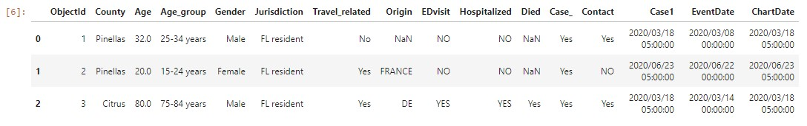

# Project 1
- **Team Members**: Chika Ozodiegwu, Kelsey Wyatt, Libardo Lambrano, Kurt Pessa


### Data set used:: 
* https://open-fdoh.hub.arcgis.com/datasets/florida-covid19-case-line-data

```python
import pandas as pd
df = pd.read_csv("Resources/Florida_COVID19_Case_Line_Data.csv")
df.head(3)
```



# There is no change in hospitalizations since reopening
### Research Question to Answer:
* “There is no change in hospitalizations since reopening” 

### Part 1: Six (6) Steps for Hypothesis Testing

<details><summary> click to expand  </summary>

#### 1. Identify
- **Populations** (divide Hospitalization data in two groups of data):
    1. Prior to opening
    2. After opening  
* Decide on the **date**:
    * May 4th - restaurants opening to 25% capacity
    * June  (Miami opening beaches)
- Distribution:
    * Distribution

#### 2. State the hypotheses
- **H0**: There is no change in hospitalizations after Florida has reopened
- **H1**: There is a change in hospitalizations after Florida has reopened

#### 3. Characteristics of the comparison distribution
- Population means, standard deviations

#### 4. Critical values
- p = 0.05
- Our hypothesis is nondirectional so our hypothesis test is **two-tailed**

#### 5. Calculate

#### 6. Decide!
    
</details>

### Part 2: Visualization
* Trends

### Further Inquries
* Increases in groups?
* Age
* Gender
* Ethnicitiy

### Rough Breakdown of Tasks
* Data Massaging